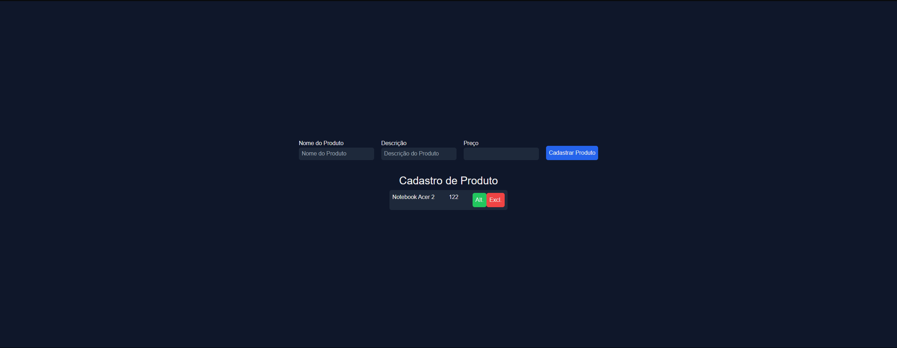

## Application FullStack

* NextJS --> Frontend
* CSS --> Tailwind
* NestJS --> Backend

> Como ficou no Web(Computador)



### Comandos

#### Comandos Front-end

> ### Comando para criar o projeto frontend_**

- criando aplicação frontend

```
npx create-next-app@latest frontend
```

<b> Obs: </b> Os camandos a seguir terão que ser executado na pasta frontend

- Entrar na pasta do frontend

```
cd frontend
```

- rodando o projeto

```
npm run dev
```

> ### Comandos Back-end

**_Comando para criar o projeto backend_**

- <b>Caso seja a primeira vez!</b>

```
npm i -g @nestjs/cli
```

- <b>Caso Erro no npm </b>

```
npm install -g npm
```

- Criando o projeto backend

```
npx nest new backend
```

> Obs: Os camandos a seguir terão que ser executado na pasta backend

- Entrar na pasta do backend

```
cd backend
```
> ### Iniciando com Prisma ORM
    
> Exemplos de ORM
* Knex.js
* Prisma
* Sequelize
<br />
<br />

> Plugin Prisma
* Instalar Extensions Prisma
<br />
<br />

> ### Instalar o prisma

```
npm install prisma --save-dev
```

**_Comando para inicializar o prisma com mysql_**

```
npx prisma init --datasource-provider mysql
```

> ### Entender sobre banco
- porta 3306
- senha padrão é ""
- usuario
- database
- .env
<br />
<br />

> #### Editar o arquivo schema.prisma e criar um model
```
model User {
     id   Int     @id @default(autoincrement())
    nome  String
    email String  @unique
    senha String

    createdAt     DateTime  @default(now())
    updatedAt     DateTime  @updatedAt
}
```
<br />
<br />

**_Comando rodar uma migration_**

```
npx prisma migrate dev
```

**_Comando para criar um modelo de banco de dados_**

```
npx nest g module db
```
<br />
<br />

**_Comando para criar um modelo de CRUD_**
* Cria uma pasta produto com 3 arquivos
```
npx nest g resource produto --no-spec
```

> Obs: marque a opção "REST API" e a opção "Y"

> Obs: O camando a baixo terá que ser executado na pasta db. "backend/src/db"

**_Comando para criar um modelo de service para o CRUD_**

```
npx nest g service prisma --flat --no-spec
```

## Ref.

- Link do vídeo: https://www.youtube.com/watch?v=aouatZu9QiU
